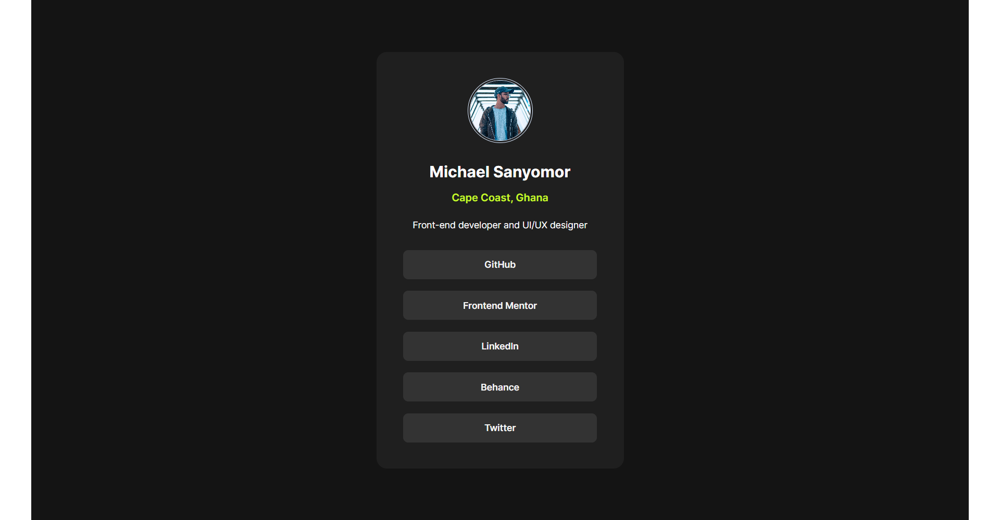
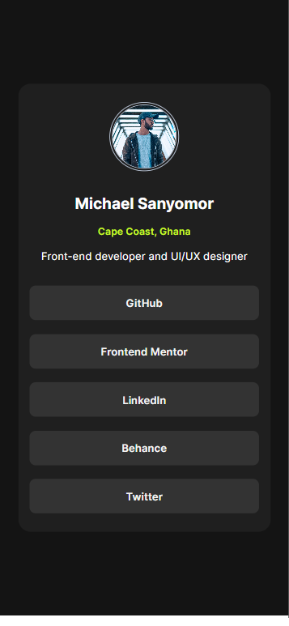

# Frontend Mentor - Social links profile solution

This is a solution to the [Social links profile challenge on Frontend Mentor](https://www.frontendmentor.io/challenges/social-links-profile-UG32l9m6dQ). Frontend Mentor challenges help you improve your coding skills by building realistic projects. 

## Table of contents

- [Overview](#overview)
  - [The challenge](#the-challenge)
  - [Screenshot](#screenshot)
  - [Links](#links)
- [My process](#my-process)
  - [Built with](#built-with)
- [Author](#author)

## Overview
A sleek and responsive social link profile component using HTML and CSS, seamlessly blending aesthetics with functionality. With  much attention to detail, the design ensures an engaging user experience, providing quick access to social media profiles through clickable links that effortlessly guide users to their intended destinations. This visually appealing component not only enhances the overall aesthetic of web pages but also guarantees a seamless and intuitive navigation experience.
### The challenge

Users should be able to:

- See hover and focus states for all interactive elements on the page

### Screenshot

### Links

- Solution URL: [My solution URL](https://github.com/sanyomor-01/social-links-profile-main)
- Live Site URL: [live site URL ](https://social-links-profile-main-pi-rosy.vercel.app)

## My process
- Redesign component on figma to get accurate layout measurements
- Strutured the component using semantic html for accessibility
- Used CSS to bring out the aesthetic look for good user experience
- Git hub for version control and tracking all changes every step in the coding process 

### Built with

- Semantic HTML5 markup
- CSS custom properties
- Flexbox
- CSS Grid
- Mobile-first workflow

## Author

- Website - [Michael Sanyomor](https://www.github/sanyomor-01)
- Frontend Mentor - [Mike](https://www.frontendmentor.io/profile/sanyomor-01)
- Twitter - [Michael](https://www.twitter.com/sanyo_mor)
